# 📄 Document Classification System: DocuSort

An end-to-end multimodal system to classify scanned documents (IDs, receipts, licenses, etc.) using both **image and text features**. The project combines OCR, deep learning models (LayoutLMv3 and a custom Early Fusion model), FastAPI, and Streamlit into a deployable `.exe` app.

---

## ✨ Demo

| OCR in Action | LayoutLMv3 in Action | Early Fusion in Action |
|:-------------------------:|:--------------------:|:----------------------:|
|  |  |  |

---

## ⏰ Table of Contents

* [Features](#-features)
* [System Requirements](#-system-requirements)
* [Getting Started](#-getting-started)
* [OCR Features](#-ocr-features)
* [Environment & Prerequisites](#️-environment--prerequisites)
* [Architecture](#-architecture)
* [File Structure](#-file-structure)
* [Model Details](#-model-details)
* [How to Run](#-how-to-run)
* [Packaging as EXE](#-packaging-as-exe)
* [Future Scope](#-future-scope)
* [License](#-license)
* [Project Slides](#-project-slides)

---

## 🌟 Features

* OCR-powered extraction using **PaddleOCR**
* Multimodal document classification using:

  * **LayoutLMv3** (text + layout + image)
  * **Custom Early Fusion Model** (BERT + ResNet + Attention)
* Fully working **Streamlit UI** + **FastAPI backend**
* Packaged into a single **`.exe` for Windows** users
* Supports classification into **10 categories** (Aadhar, Passport, PAN, Voter ID, etc.)

---

## 🚀 System Requirements

* OS: Windows 10 or 11
* GPU: NVIDIA RTX 3050 (for GPU OCR)
* CUDA Toolkit: 12.6 or 12.8 (if using GPU PaddleOCR)
* Python: 3.11.5 (64-bit)
* RAM: 8GB+
* Processor: x86\_64 / Intel64 / AMD64

---

## ✅ Getting Started

### 📦 Download Dataset

```python
import gdown, zipfile, os
file_id = "1Gu23xr357BPzGoocyPw6IPUhnz5mf52j"
gdown.download(f"https://drive.google.com/uc?id={file_id}", "file.zip", quiet=False)
with zipfile.ZipFile("file.zip", 'r') as zip_ref:
    zip_ref.extractall("Data")
os.remove("file.zip")
```

Or [Download Manually](https://drive.google.com/file/d/1Gu23xr357BPzGoocyPw6IPUhnz5mf52j/view?usp=sharing)

---

## 🧠 OCR Features

This project utilizes **PaddleOCR** by Alibaba Cloud.

### 🔍 Key Features in PaddleOCR 3.0:

* 🖼️ **Universal-Scene Text Recognition Model**: Handles five text types + complex handwriting. +13% improvement over previous generation.
* 🧮 **General Document-Parsing**: Parses multi-layout, multi-scene PDFs with high precision.
* 📈 **Document Understanding**: Powered by ERNIE 4.5 Turbo; +15% accuracy boost over its predecessor.

---

## 🛠️ Environment & Prerequisites

### 🧪 Create Separate OCR Environment

```bash
python -m venv env/OCRenv
```

Activate:

```bash
env\OCRenv\Scripts\activate.bat
```

### ✅ Check Python Compatibility

Supported Python versions:

* 3.8 / 3.9 / 3.10 / 3.11 / 3.12 / 3.13

Check Python version:

```bash
python --version
```

Check pip version:

```bash
python -m pip --version
```

Check architecture:

```bash
python -c "import platform;print(platform.architecture()[0]);print(platform.machine())"
```

Expected Output:

```
64bit
x86_64 (or AMD64)
```

### 🖥️ Platform Limitations

* No NCCL/distributed training on Windows.
* Requires MKL-compatible CPU (all Intel chips support this).

### 🚀 Install PaddleOCR GPU Version

```bash
python -m pip install paddlepaddle-gpu==3.0.0 -i https://www.paddlepaddle.org.cn/packages/stable/cu126/
python -m pip install paddleocr
```

### 🍫 Install Chocolatey & ccache (Optional for caching)

```powershell
Set-ExecutionPolicy Bypass -Scope Process -Force; \
[System.Net.ServicePointManager]::SecurityProtocol = \
[System.Net.ServicePointManager]::SecurityProtocol -bor 3072; \
iex ((New-Object System.Net.WebClient).DownloadString('https://community.chocolatey.org/install.ps1'))
```

Then:

```bash
choco upgrade chocolatey
choco install ccache
where ccache
```

Add `C:\ProgramData\chocolatey\bin` to PATH if not found.

---

## 🧱 Architecture

1. **OCR** (PaddleOCR)
2. **Text/Image Embedding** (BERT + ResNet)
3. **Fusion** (Early Fusion Attention / LayoutLMv3)
4. **Classification**
5. **UI + API Serving** (Streamlit + FastAPI)

---

## 📁 File Structure

```text
├── api/               # FastAPI endpoints
├── assets/            # icon, demo video
├── pipeline/          # single image end-to-end pipeline
├── requirements/      # env-specific dependencies
├── scripts/           # .bat, .ps1, .exe launcher
├── src/               # development and training code
├── streamlit_ui/      # Streamlit frontend
├── test_results/      # test_pred.csv
├── DocuSort.exe       # Windows executable
├── accuracy_plot.png
├── check_splits.py
├── config.py
├── main_fastapi.py
└── README.md
```
File Descriptions

- **`api/`** – Hosts the FastAPI routes that handle classification requests and serve OCR/model predictions.

- **`pipeline/`** – Integrates OCR and the model to classify a single image end-to-end. Useful for scripting and testing.

- **`src/`** – Main training code: dataset loaders, model architectures (LayoutLMv3, Early Fusion), and utilities.

- **`streamlit_ui/`** – User interface to upload and classify documents via the browser. Shows results in real time.

- **`scripts/`** – Contains `.bat`, `.ps1`, and the `DocuSort.exe` generator for local deployment.

- **`requirements/`** – Separated `.txt` files for installing base, training, or OCR-specific Python dependencies.

- **`test_results/`** – Contains `test_pred.csv` used for evaluating or submitting to benchmarks.

- **`DocuSort.exe`** – Final packaged application for Windows — opens both backend and UI in one click.

- **`config.py`** – Centralized config: model name, class labels, thresholds, paths.

- **`accuracy_plot.png`** – Snapshot of training performance to visually track overfitting/generalization.

- **`check_splits.py`** – Verifies dataset balance across train, val, and test sets.

- **`main_fastapi.py`** – Starts the FastAPI app and defines how endpoints behave.

---

## 🧠 Model Details

### ✅ LayoutLMv3

* Combines text + image + layout (bounding boxes)
* Fine-tuned using Parquet-formatted OCR documents

### ✅ Early Fusion Model

* `bert-base-uncased` for text embeddings
* `resnet-50` for image embeddings
* Multi-head attention to fuse modalities
* Weighted CrossEntropyLoss to handle imbalance

> 👨‍💻 **Primary Contributors**: *Paul Samuel W E, Sanjesh J*

### ❌ ViT Vision-only (FAILED)

* Overfit on training, poor generalization (Test Acc: 28%)

---

## 🔧 How to Run

### 🔁 During Development

```bash
# Start FastAPI server
uvicorn main_fastapi:app --port 8000

# In another terminal
streamlit run streamlit_ui/app.py
```

### 🖱️ Using Executable

```bash
scripts/DocuSort.exe
```

* Launches both servers
* Opens UI in browser
* Prompts to shut down (Y/N)

---

## 📦 Packaging as EXE

```powershell
Invoke-ps2exe `
  -inputFile ".\scripts\run_and_stop.ps1" `
  -outputFile ".\scripts\DocuSort.exe" `
  -title "DocuSort" `
  -icon ".\assets\icon.ico" `
  -requireAdmin `
  -noConsole
```

---

## 🚧 Future Scope

* Sentence-BERT for better textual embeddings
* Spell/grammar correction on noisy OCR
* Multilingual support (Hindi, Tamil, etc.)
* Mobile/web deployment (React Native, Flask, etc.)
* GPU inference + caching for faster batch processing

---

## 🧾 License

MIT License

---

## 👥 Contributors

* **Paul Samuel W E** *(Model, OCR Pipeline, Architecture, Packaging)*
* **Sanjesh J** *(Early Fusion Model, Evaluation)*
* Gayathri R
* Sri Yogesh B A
* Samritha S

<h2>📸 Project Slides</h2>

<div align="center" style="display: flex; justify-content: center; overflow-x: auto; gap: 10px;">
  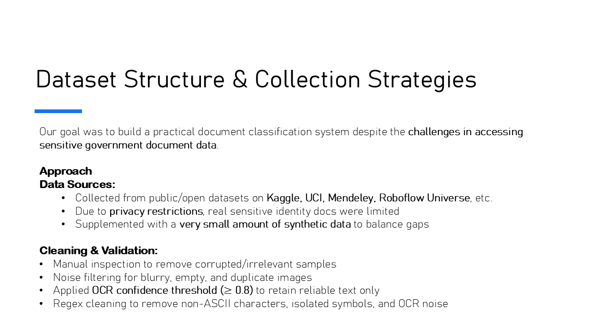
  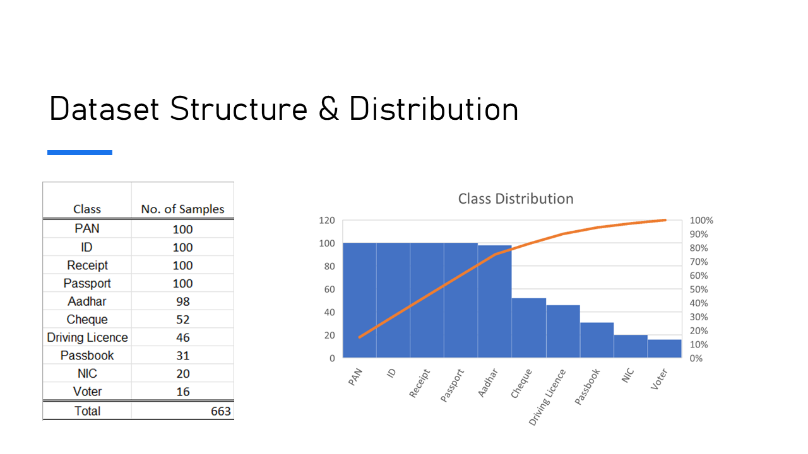
  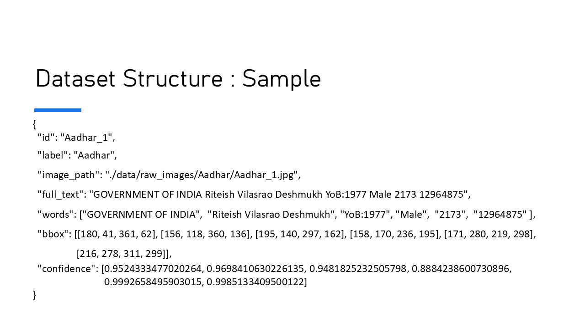
  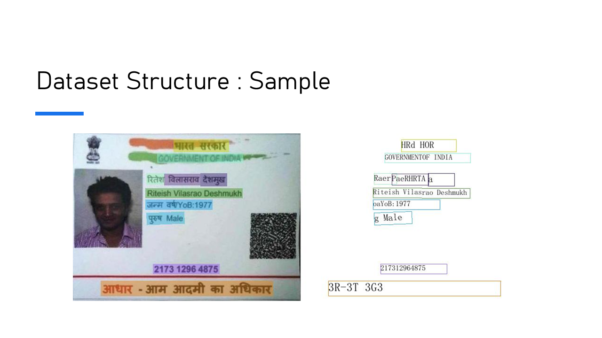
  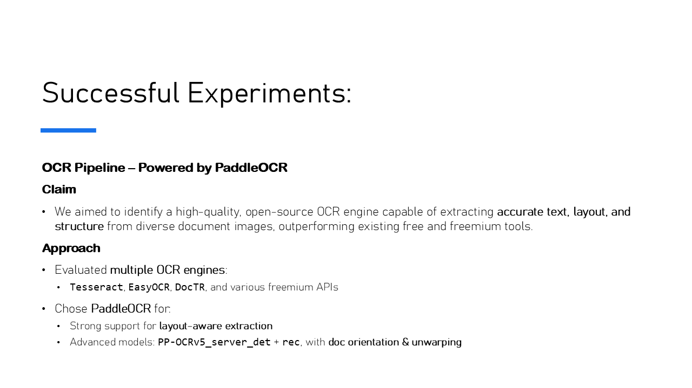
  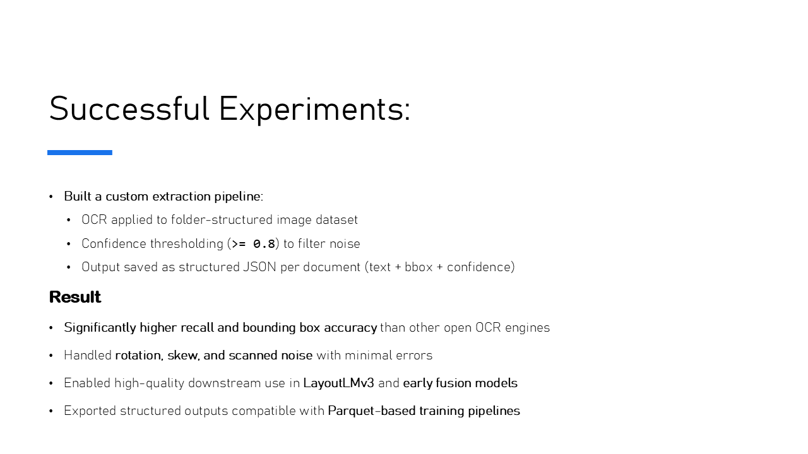
  
  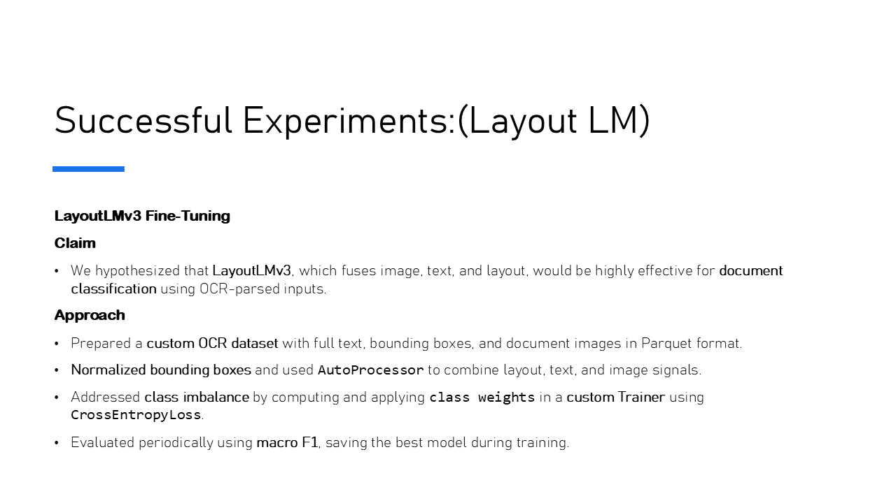
  
  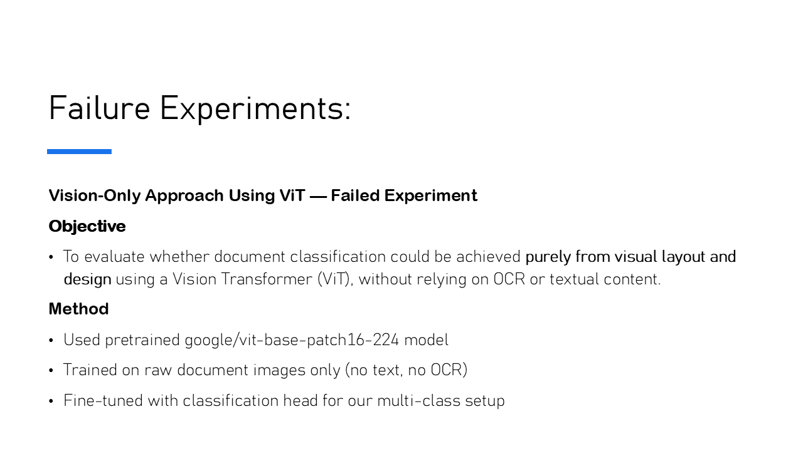
  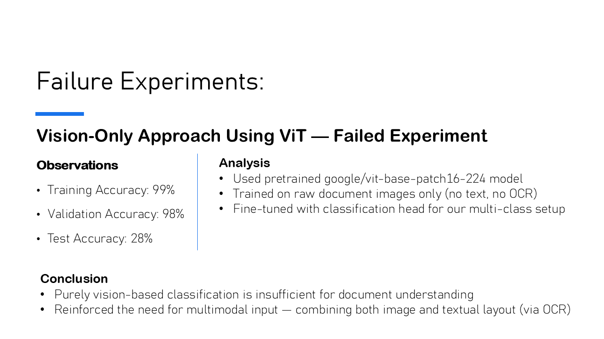
  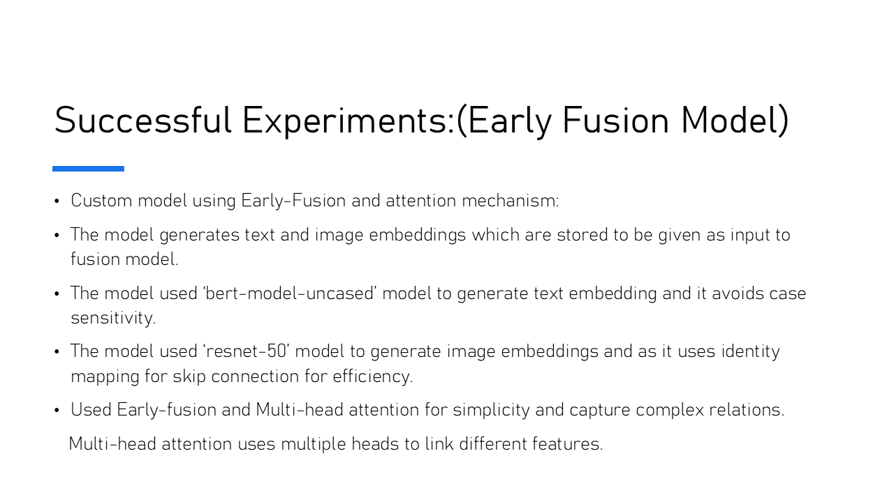
  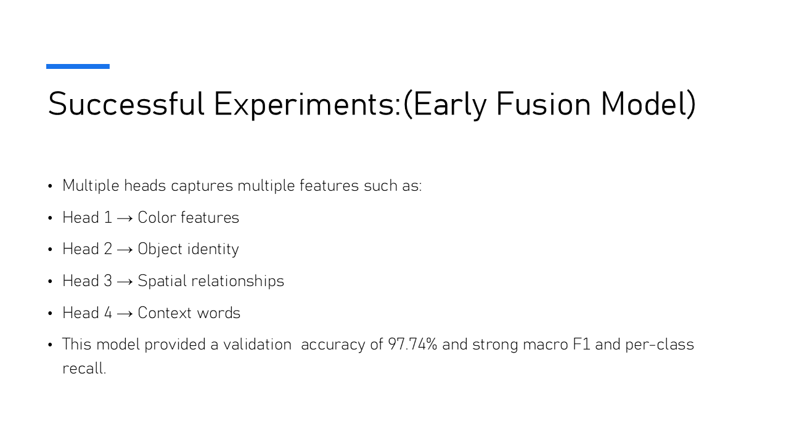
  
  
  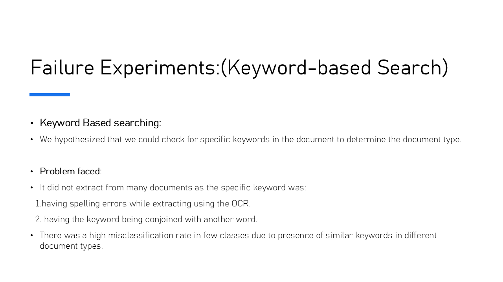
</div>


> Project Completed: **July 21, 2025**
